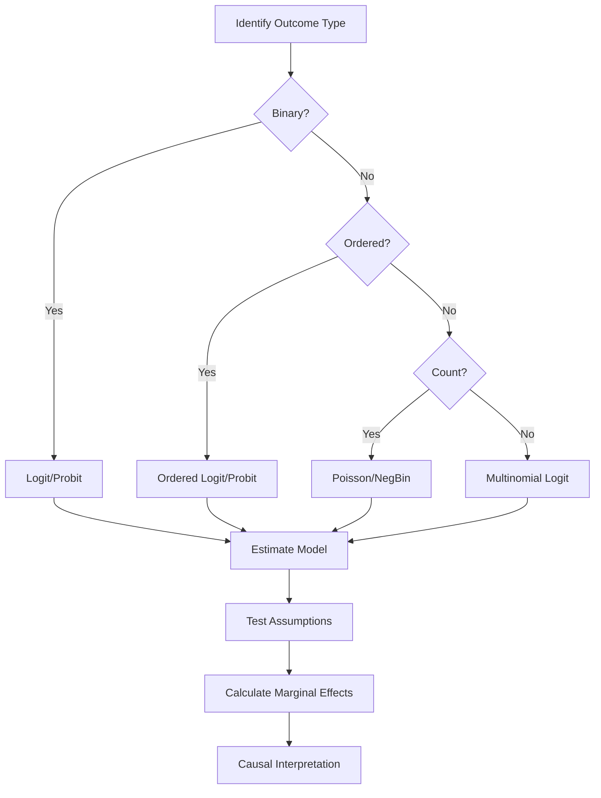

# Discrete Choice Models Skill

## Overview

This skill provides tools for estimating and interpreting limited dependent variable models in causal inference contexts. It covers binary choice (logit, probit), ordered choice, multinomial choice, and count data models.

## When to Use

Activate this skill when:
- Outcome variable is binary (0/1)
- Outcome is categorical with natural ordering (e.g., ratings, education levels)
- Outcome is unordered categorical (e.g., mode choice, brand selection)
- Outcome is a count (e.g., number of visits, patent counts)
- User mentions: logit, probit, ordered probit, multinomial logit, Poisson, negative binomial, count data, discrete outcome, categorical outcome

## Key Concepts

### Binary Choice Models
- **Linear Probability Model (LPM)**: Simple but can predict outside [0,1]
- **Logit**: Logistic distribution, closed-form odds ratios
- **Probit**: Normal distribution, better for multivariate models

### Ordered Choice Models
- **Ordered Logit/Probit**: For naturally ordered categories
- **Parallel Lines Assumption**: Key identifying assumption

### Multinomial Choice Models
- **Multinomial Logit (MNL)**: Independence of Irrelevant Alternatives (IIA)
- **Nested Logit**: Relaxes IIA within nests
- **Mixed Logit**: Random coefficients for heterogeneity

### Count Models
- **Poisson**: Mean equals variance assumption
- **Negative Binomial**: Allows overdispersion
- **Zero-Inflated Models**: Excess zeros from separate process

## Causal Interpretation

### Marginal Effects
- **Average Marginal Effect (AME)**: Population average of individual marginal effects
- **Marginal Effect at Mean (MEM)**: Effect evaluated at covariate means
- **AME preferred for causal interpretation**: Angrist & Pischke (2009)

### Treatment Effects
- For binary treatments: AME approximates ATE under conditional independence
- Interaction effects require careful computation
- Heterogeneous effects across covariate values

## Workflow



## Files in This Skill

### References
- `binary_choice.md` - Logit, Probit, LPM comparison, marginal effects
- `ordered_choice.md` - Ordered logit/probit, parallel lines assumption
- `multinomial_choice.md` - MNL, nested logit, IIA assumption
- `count_models.md` - Poisson, negative binomial, zero-inflated, overdispersion
- `causal_interpretation.md` - Treatment effects with discrete outcomes

### Scripts
- `run_discrete_model.py` - Discrete choice model fitting CLI
- `calculate_marginal_effects.py` - AME, MEM calculations
- `test_model_assumptions.py` - IIA test, parallel lines, overdispersion
- `visualize_predictions.py` - Predicted probabilities, marginal effect plots

### Main Implementation
- `discrete_choice_estimator.py` - Core estimation and marginal effects

### Assets
- `assets/latex/discrete_table.tex` - Marginal effects table template

## Quick Start

```python
from discrete_choice_estimator import DiscreteChoiceEstimator

# Binary choice
estimator = DiscreteChoiceEstimator(model_type='logit')
result = estimator.fit(y, X, treatment='treatment_var')
ame = estimator.marginal_effects(method='average')

# Count data
estimator = DiscreteChoiceEstimator(model_type='negbin')
result = estimator.fit(count_y, X)
```

## Best Practices

1. **Always report marginal effects**, not just coefficients
2. **Use AME for causal interpretation** when treatment is binary
3. **Test model assumptions** before interpreting results
4. **Consider LPM as robustness check** for binary outcomes
5. **Address overdispersion** in count models with NegBin or quasi-Poisson
6. **Test IIA** in multinomial logit before accepting results

## References

- Angrist, J. D., & Pischke, J. S. (2009). Mostly Harmless Econometrics
- Cameron, A. C., & Trivedi, P. K. (2005). Microeconometrics
- Train, K. E. (2009). Discrete Choice Methods with Simulation
- Wooldridge, J. M. (2010). Econometric Analysis of Cross Section and Panel Data
